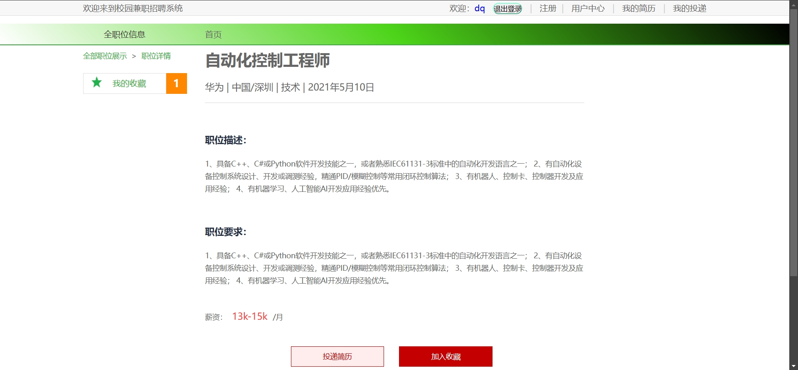
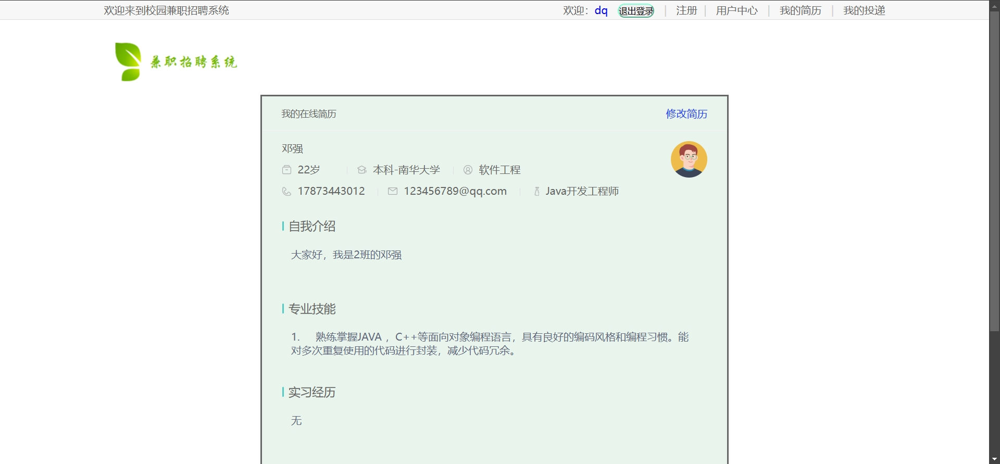
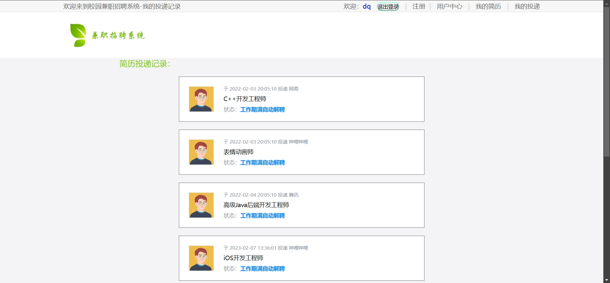
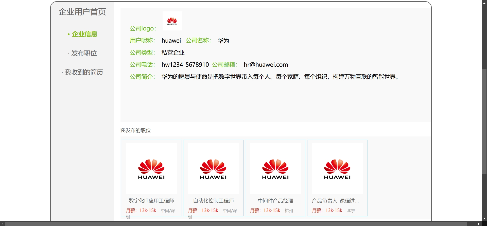
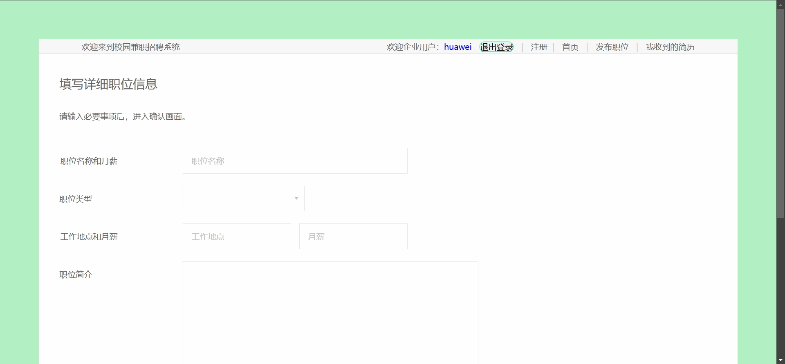
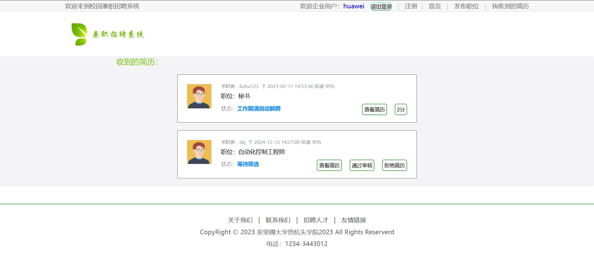
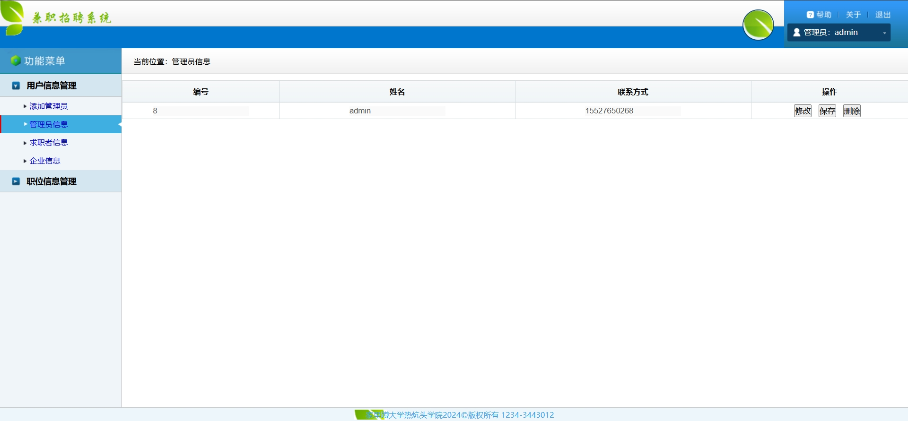
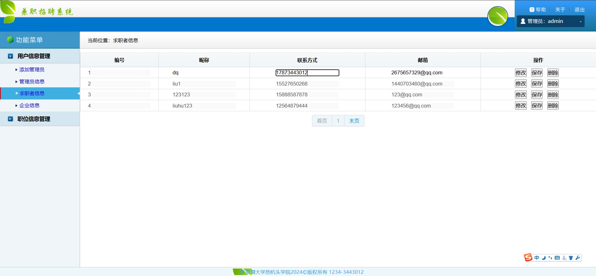
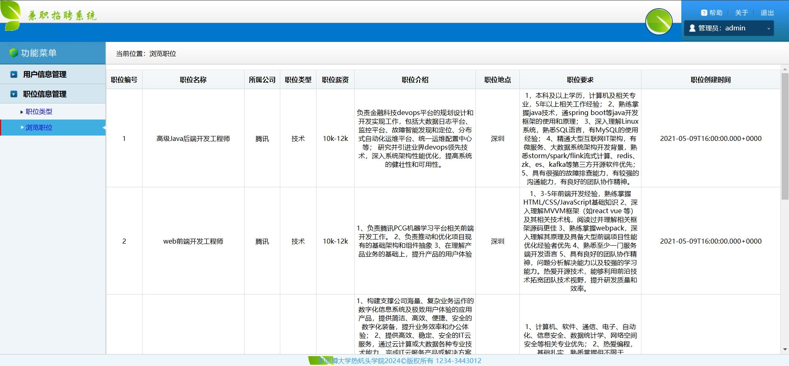

# 校园兼职招聘系统(数据库加VX获取☟)

#### 介绍
校园兼职招聘系统(Java_SpringBoot)
有BUG可留言加微

#### 软件架构
Java + SpringBoot + Mybatis + Mysql

#### 项目功能说明

1.  管理员功能
> + 用户信息管理：管理员信息、求职者信息、企业信息
> + 职位信息管理：职位类型、浏览职位
2.  企业用户功能
> + 登录注册
> + 企业信息
> + 发布职位
> + 收到的简历：查看简历、审核简历
2.  求职用户功能
> + 登录注册
> + 首页：轮播图、职位分类展示
> + 职位展示：职业详情、投递简历、加入收藏
> + 用户中心：个人信息、我的简历、我的投递、修改密码等

### 部分功能演示

### 环境需求(可免费提供)
- idea/eclipse、jdk-1.8、maven-3.8.6、mysql、node.js等

## 有项目修改、安装调试需求 请联系微信

## 其他项目定制加微☝☝☝

